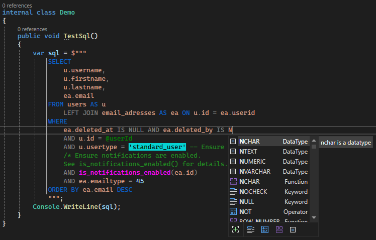

# SqlTools

  
SQL syntax highlighting and completion for string literals in Visual Studio.

## Why the fork?
This project was forked from [mojtabakaviani/sqltools](https://github.com/mojtabakaviani/sqltools), and includes a fix from [abdonkov/sqltools](https://github.com/abdonkov/sqltools).  
The original extension can be found [here](https://marketplace.visualstudio.com/items?itemName=Mojtabakaviani.SqlTools).  
I wanted some improvements, and the original repository seemed a bit stale.  
Some of the additional changes include, but are not limited to:
* Highlighting of single- and multi-line comments.
* Auto-completion suggestions only show up when the cursor is inside a string literal.
* Project updated to remove remnants of older project formats.
* General code clean-up and misc. minor fixes.

**The latest release can be found on the [Visual Studio Marketplace](https://marketplace.visualstudio.com/items?itemName=MaverickMartyn.sqltools-improved).**

## What it looks like

## Building and debugging
Nothing special required for the extension itself.

### Requirements
* Visual Studio 2022 - (Possibly older, untested)

### Building
Just build it using MSBuild CLI or Visual Studio. Can be debugged using experimental mode like normal.  
To publish a new release, push a tag using `git tag v2.3.1 -a "Annotated tag description."`, and then pushing it using `git push origin --tags`.

## Workflows
GitHub Actions has been configured to automatically build upon new commits.  
Upon pushing a new tag using the format `vMAJOR.MINOR.PATCH`, will trigger a release build and automatically publish it on the Visual Studio Marketplace.

All these builds can be found under the [Build extension](https://github.com/MaverickMartyn/sqltools/actions/workflows/sqltools-release.yml) workflow.  
Look for the ones marked as `vMAJOR.MINOR.PATCH` for release builds, and those with `main` for automatic "nightly" builds.

### Debugging workflows
For workflow debugging, I recommend using [nektos/act](https://github.com/nektos/act) to run the workflows locally.  
Unfortunately, ACT does not support windows containers at the moment, so the `-P windows-latest=-self-hosted` parameter is required.

### Requirements
* [nektos/act](https://github.com/nektos/act)
* NodeJS 20.

Just run `act -P windows-latest=-self-hosted --artifact-server-path ./artifacts` to test the builds.
